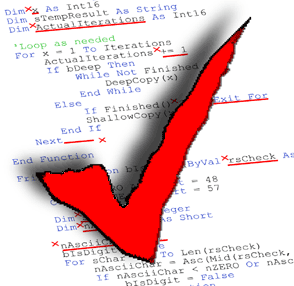

 
 
Coding standards are a technique that people usually decide not to learn or master in the field of software engineering. Whether to use spaces to indent, or whether to start a new line with just the close-curly-brace are examples of what some people regard to be minor details. But why are coding standards treated so dismissively by so many people?

One of the reasons might be that coding standards first appear to be a burden when you have to obey rigorous rules, especially when you're just getting started and in the process of learning how to code. It is simple to feel that you are being restrained back, and it is alluring to ignore the rules and focus just on the task at hand. 

In my own experience, I used to believe that coding standards were simply one more difficult obstacle to overcome while learning how to code. As a newbie, the thought of needing to adhere to rigid standards while coding felt oppressive and restricting. When using ESLint with IntelliJ to learn Javascript, I was more concerned with finishing the work than I was with paying attention to the red lines that occurred. But as I used the tool more, the value of coding standards became clearer to me. The red lines, which I formerly considered to be a pain, were useful in identifying possible bugs and making my code tidier. I came to understand that the purpose of the coding standards was to make sure that my code was accurate.

In fact, sticking to coding standards can help you become a better programmer. You will gain knowledge of best practices and develop the habit of writing code that is simpler to comprehend and maintain, benefiting not just you but also others who may have to work with your code in the future. After the experience, I understood that coding standards should not be neglected or undervalued. Following coding standards will eventually become a natural part of the coding process since they are so important in assuring the quality and maintainability of code.

