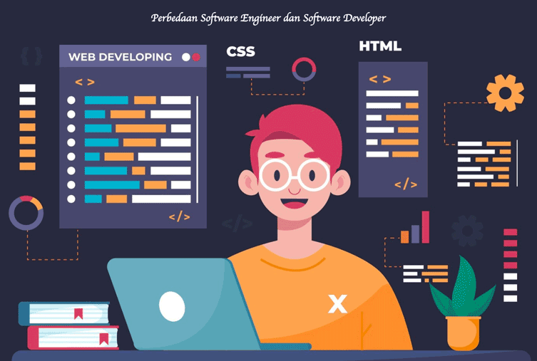

 

## The Transition from ICS314
This semester, I took ICS414 Software Engineering II, which built upon the foundation laid in ICS314 Software Engineering I. Unlike the previous course where we worked in smaller groups of three, ICS414 involved a larger team of eight members collaborating on a real-world project for a client.

## The Voluntree Project
Our group was tasked with designing a website for Voluntree, a non-profit organization based in Honolulu. We utilized the skills and technologies learned in ICS314, such as Meteor and React, to satisfy the client's requirements and deliver a functional product.

## Scaling Up: Challenges and Growth
Compared to ICS314, managing a larger team and adhering to client demands presented new challenges in ICS414. Time management and effective collaboration became crucial factors in ensuring the project's success. While I had gained experience in these areas from the previous course, there was still room for improvement.

## Putting Lessons into Practice
Throughout the semester, I made conscious efforts to enhance my time management skills and teamwork abilities. The lessons learned in ICS314 provided a solid foundation, but working with a larger group and meeting client expectations required a heightened level of organization and communication.

## Navigating Real-World Client Expectations
One of the significant differences between the two courses was the added responsibility of catering to a real client's needs. Unlike hypothetical scenarios, we had to carefully analyze and interpret the client's requirements, adapting our approach as necessary to deliver a satisfactory product.

## Invaluable Experiences and Lessons Learned
Despite the challenges, the experience of working on a real-world project with a larger team was invaluable. It allowed me to further strengthen my skills in collaborative software development, time management, and client communication – essential competencies for any software engineer.

## Preparing for the Professional World
While there is always room for improvement, I feel that ICS414 has better prepared me for the realities of software engineering in a professional setting. The hands-on experience and the lessons learned from navigating a larger team and client expectations have been instrumental in my growth as a software developer.
