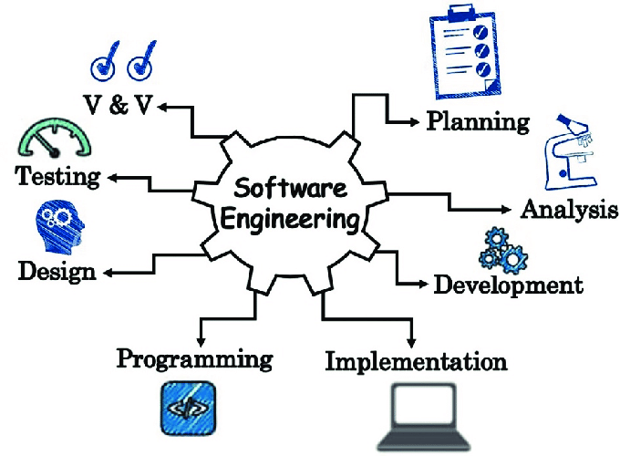

 
 
I debated what major to choose to study in college before I discovered the field of computer science. I didn't get interested in computer science not even computers until my friend, who was majoring in it, told me about all the fantastic employment chances that come with a degree in it. I decided to give it a shot and registered for ICS111, my first computer science course. I quickly fell in love with programming, much to my surprise.

The first project I completed for that class was making a card game, which really opened my eyes to the virtually limitless possibilities that programming provides. I was amazed at the degree of freedom it provided and how I could bring my creative ideas to life. Debugging and problem-solving also turned out to be exciting since I never felt so proud of myself after each successful bug fix.

Finished more ICS courses, made me more confirmed my desire to pursue a career as a software engineer. I was really fascinated by the power of technology to improve people's lives and the joy that comes from developing something new. And so, I continued my journey in computer science and took the course ICS314: Software Engineering. I hope this course can further solidify my passion for the field and brought me closer to my ultimate goal of becoming a software engineer.

In the future, I wish to improve my coding skills. I understand that coding is my weakness after failing the second WOD(workout of the day) in the ICS314, therefore I will spend more time mastering the languages I have already learned before attempting to learn a new one. I will practice how to code more efficiently and being more familiar with the language such as the syntax. 

Additionally, I want to learn more about the field by participating in real-world projects and conducting research. I hope the experiences will not only increase my knowledge but will also enable me to put my skills to use and advance as a programmer. I believe that by dedicating the time and effort required to acquire these skills and experiences, I will be able to become a well-rounded and confident developer.

