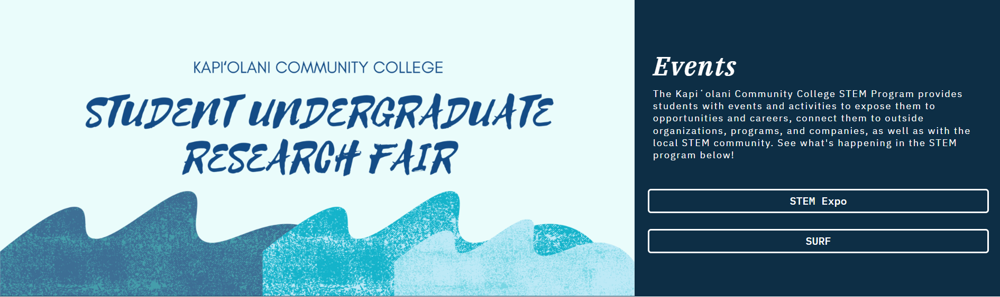

## Experience of participating in the National Science Foundation Geopaths

Participating in the National Science Foundation Geopaths - Impact program during the fall semester of 2021 was a very eye-opening experience for me. I have the opportunity to develop my leadership skills by volunteering to help with both the STEM Expo and the Student Undergraduate Research Fair (SURF).

Throughout the experience, I got the chance to design and create the event page for the KCC STEM website using the Elementor website builder. Even though it was difficult, I managed to learn how to make a website that is user-friendly, visually beautiful, and searches engine-friendly. This was a great valuable lesson for me since it gave me a chance to use my technical knowledge in a practical situation.

Overall, participating in the National Science Foundation Geopaths - Impact program was a truly meaningful and rewarding experience. It allowed me to grow both personally and professionally and I am grateful for the opportunity. I look forward to applying what I have learned in future projects and endeavors.

Source: <a href="https://kccstem.com/"><i class="large kccstem icon"></i>kccstem</a>

