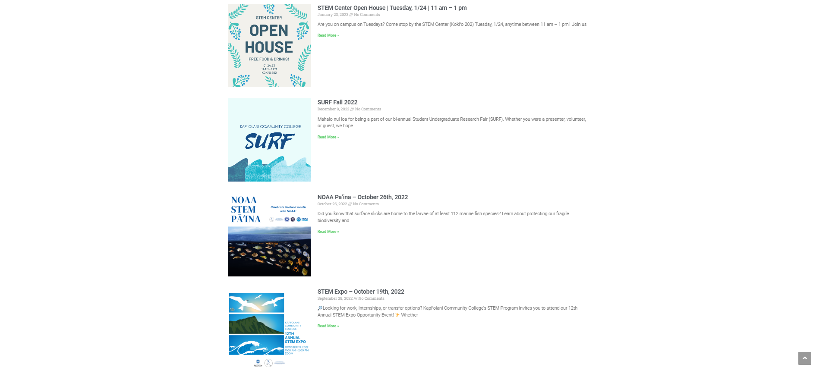

## My experience of participating in the National Science Foundation Geopaths

Participating in the National Science Foundation Geopaths - Impact program during the fall semester of 2021 was an incredibly enriching experience for me. The program provided me with the opportunity to give back to my community by volunteering to help organize both the Student Undergraduate Research Fair (SURF) and the STEM Expo. Through these opportunities, I was able to strengthen my leadership skills, collaborate with faculty mentors, and gain a deeper understanding of the event organization process.

One of the most exciting aspects of the program for me was the chance to work on web design using Elementor. I had the opportunity to design and develop the KCC STEM website, specifically the event page. It was challenging, but I was able to learn how to create a website that was both visually appealing and user-friendly, and how to optimize it for search engines. This experience was particularly valuable as it allowed me to put my technical skills to the test in a real-world setting.

Overall, participating in the National Science Foundation Geopaths - Impact program was a truly meaningful and rewarding experience. It allowed me to grow both personally and professionally and I am grateful for the opportunity. I look forward to applying what I have learned in future projects and endeavors.

Source: <a href="https://kccstem.com/"><i class="large kccstem icon"></i>kccstem</a>

