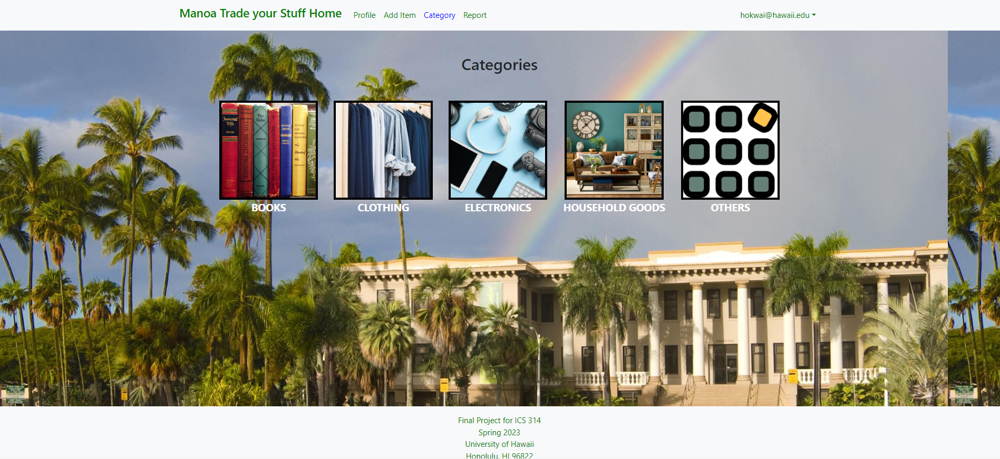

## About the project
Manoa Trade Your Stuff is a team project for ICS 314. The aim of this project is to establish a marketplace that facilitates the buying and selling of campus-specific goods and services for the students, faculty, and staff of UHM in a hassle-free and efficient manner. The system enables users to easily search and browse through the available items and create their own listings to sell. Additionally, it comprises user profiles, categorization of different types of items, and a reporting mechanism to flag any inappropriate activity. The ultimate goal is to establish a secure, user-friendly, and productive platform that encourages UHM students to recycle and reuse campus-specific goods and services. 

## What you learned from this Project
Throughout the course of this project, I have acquired a multitude of valuable skills and knowledge. Firstly, I learned how to effectively collaborate with my teammates. Secondly, I gained experience in creating a website using Meteor React, which included designing the layout, implementing functionality, and adding various features. I also learned how to handle merge conflicts, an essential skill for team-based development. Additionally, I was introduced to TestCafe, which enabled me to test the program and ensure that it was functioning correctly. Moreover, I gained experience in deploying a website, which involved setting up a server and deploying the application to it. Lastly, I learned how to break down a project into a series of milestones, which helped us work more efficiently and complete the project within the given timeline. Overall, this project was an excellent opportunity to acquire and refine various skills that will be useful in my future career.

## Contributions
<li> Create Add Profile Page </li>
<li> Create Edit Profile Page </li>
<li> Create Profile Page </li>
<li> Create Item List </li>
<li> Optimize Categoies Page </li>
<li> Optimize Item List Page </li>
<li> Adding CSS </li>

<a href="https://manoa-trade-your-stuff.github.io/"><i class="large github icon "></i>Github page</a>
<a href="https://manoatradeyourstuff.site/"><i class="large github icon "></i>Manoa Trade Your Stuff Home Page</a>

