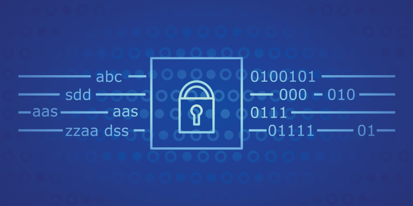

The Secure Hash Algorithm 1 (SHA-1) is a cryptographic hash function that creates a hash or message digest from a variable-size input, such as a file or message. It was created in 1993 by the National Institute of Standards and Technology(NIST) of the United States government. 


## What I learned from this project
This project was completed in C language in the ICS 212 Spring semester of 2022. Working on SHA-1 has helped me to better understand a number of fundamental concepts in computer science and cryptography. The technique is a well-known illustration of a cryptographic hash function and offers an excellent chance to understand the characteristics that make hash functions secure. 

## What is SHA-1? 
SHA-1 is a cryptographic hash function that is used to generate a fixed-length output from an input of any size. It is a widely used algorithm for data security and integrity, and it is frequently used for file integrity verification and digital signatures. The process of generating a hash value using SHA-1 involves several steps, including padding, initialization, and processing.

In order to create a hash value using SHA-1, the input message must first be padded to a length that is a multiple of 512 bits (64 bytes). This is accomplished by first adding a 1-bit, followed by zero or more 0-bits, and lastly the number of bits in the original message. This guarantees that the supplied message is a size that can be processed.

The next step is to initialize each of the five 32-bit registers (A, B, C, D, and E) with a specified value. These registers are utilized to process the input message and are essential to the algorithm's complexity and security.

The padded message is then divided into 512-bit (or 64-byte) chunks and put through a number of processes. These operations include breaking the block into 16 32-bit words and performing a series of logical operations and rotations on the words and the registers.  Since the original message cannot be easily recreated from the hash value, these processes are intended to be complex and challenging to reverse. The five 32-bit registers are also used, and distinct values are used for each of them, which adds to the process' complexity and difficulty in reversing.

Here is some code that illustrates how shifting works:
```cpp
unsigned int f(unsigned int t, unsigned int B, unsigned int C, unsigned int D){    
    if(0 <= t && t <= 19){
        return (B & C) | ((~B) & D);
    }
    else if(20 <= t && t <= 39){
        return (B ^ C ^ D);
    }
    else if(40 <= t && t <= 59){
        return (B & C) | (B & D) | (C & D);
    }
    else if(60 <= t && t <= 79){
        return (B ^ C ^ D);
    }
    return t;
}

//A sequence of constant words K(0), K(1), ... , K(79)
unsigned int k(unsigned int t){
    if(0 <= t && t <= 19){
        return 0x5A827999;
    }
    else if(20 <= t && t <= 39){
        return 0x6ED9EBA1;
    }
    else if(40 <= t && t <= 59){
        return 0x8F1BBCDC;
    }
    else if(60 <= t && t <= 79){
        return 0xCA62C1D6;
    }
    return t;
}
```

Source: <a href="https://github.com/hokwaichan/ICS212FinalProject"><i class="large github icon "></i>finalProject/ics-212-SHA-1</a>
