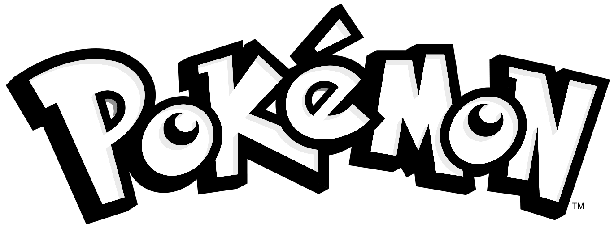
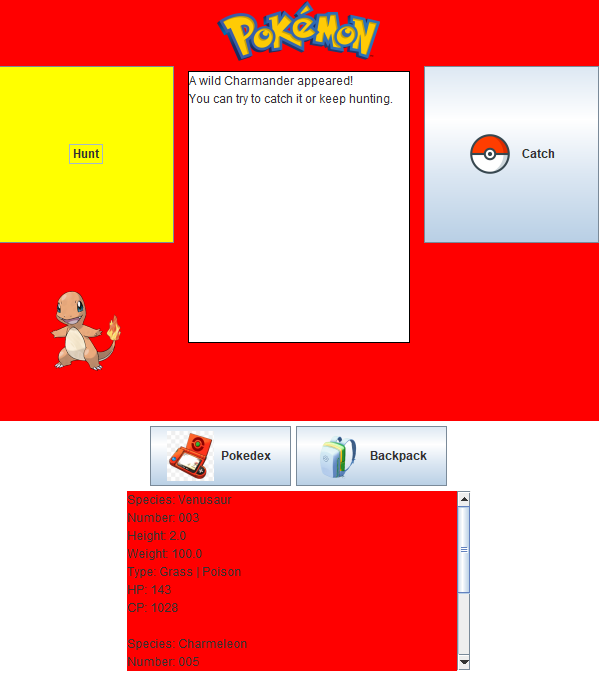

The assignment is to build a Graphical User Interface (GUI) for a Pokemon species hierarchy program.  

## What is GUI? 
In Java, GUI stands for Graphical User Interface. It is a way to interact with a program through visual elements such as buttons, text fields, and windows. GUI provides a user-friendly way to interact with a program, rather than using command-line input and output. Java provides a rich set of libraries and classes to create GUI-based applications, such as the Abstract Window Toolkit (AWT) and the Swing library. These libraries provide a wide range of components such as buttons, labels, text fields, and more that can be used to create a graphical interface for a program. Additionally, Java also provides layout managers to control the placement of components in a window, and event-handling mechanisms to respond to user interactions with the GUI components.

## What I learned from this project
From this project, I have learned how to use a Graphical User Interface (GUI) to create a 2D frame, which is an essential skill for creating user-friendly programs. I have also learned how to use different functions to make the program more interesting and playable, such as the hunting and catching system. This system allows users to randomly select and catch Pokemon. I have also learned how to use data structures like stack and priority queue to sort the caught and met Pokemon, which is an important aspect of the program. This has helped me to understand how to effectively implement sorting mechanisms and understand the differences between different data structures. Overall, this project has allowed me to practice and deepen my understanding of various programming concepts and techniques that I have learned throughout the semester.

This is what the game looks like: 

Source: <a href="https://github.com/hokwaichan/ICS211FinalProject"><i class="large github icon "></i>finalProject/ics-211-pokeGui</a>
