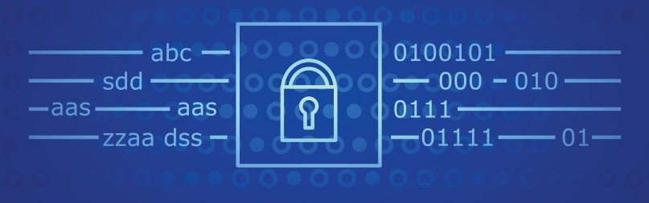

The Secure Hash Algorithm 1 (SHA-1) is a cryptographic hash function that takes a variable-size input, like a file or message, and generates a hash or message digest from it. The National Institute of Standards and Technology (NIST) of the US government developed it in 1993.


## What I learned from this project
This project was done in C during the spring semester of 2022 for the class ICS 212. Working on SHA-1 has helped me to better understand a number of fundamental concepts in computer science and cryptography. The technique is a well-known illustration of a cryptographic hash function and offers an excellent chance to understand the characteristics that make hash functions secure. 


## What is SHA-1? 
Using an input of arbitrary size, the SHA-1 cryptographic hash algorithm creates a fixed-length output. It is a commonly used algorithm for file integrity verification and digital signatures, as well as for data security and integrity. Padding, initialization, and processing are some of the stages involved in creating a hash value using SHA-1.

The input message must first be padded to a length that is a multiple of 512 bits in order to generate a hash value using SHA-1 (64 bytes). This is done by first adding a 1-bit, then adding zero or more 0-bits, and then adding the original message's bit count. This ensures that the message size provided is one that can be processed.

The next step is to set the starting values for each of the five 32-bit registers (A, B, C, D, and E). The complexity and security of the algorithm depend on these registers, which are used to process the input message.

Then, after being split into 512-bit (or 64-byte) segments, the padded message is put through a variety of operations. The block is divided into 16 32-bit words as part of these operations, and the words and registers are subjected to a number of logical operations and rotations. These procedures are designed to be intricate and difficult to undo since the original message cannot be simply reconstructed from the hash value. The five 32-bit registers are also utilized, and unique values are used for each of them, which increases the complexity of the procedure and makes it challenging to reverse.

Here is some code that illustrates how shifting works:

```cpp
unsigned int f(unsigned int t, unsigned int B, unsigned int C, unsigned int D){    
    if(0 <= t && t <= 19){
        return (B & C) | ((~B) & D);
    }
    else if(20 <= t && t <= 39){
        return (B ^ C ^ D);
    }
    else if(40 <= t && t <= 59){
        return (B & C) | (B & D) | (C & D);
    }
    else if(60 <= t && t <= 79){
        return (B ^ C ^ D);
    }
    return t;
}

//A sequence of constant words K(0), K(1), ... , K(79)
unsigned int k(unsigned int t){
    if(0 <= t && t <= 19){
        return 0x5A827999;
    }
    else if(20 <= t && t <= 39){
        return 0x6ED9EBA1;
    }
    else if(40 <= t && t <= 59){
        return 0x8F1BBCDC;
    }
    else if(60 <= t && t <= 79){
        return 0xCA62C1D6;
    }
    return t;
}
```

Source: <a href="https://github.com/hokwaichan/ICS212FinalProject"><i class="large github icon "></i>finalProject/ics-212-SHA-1</a>
